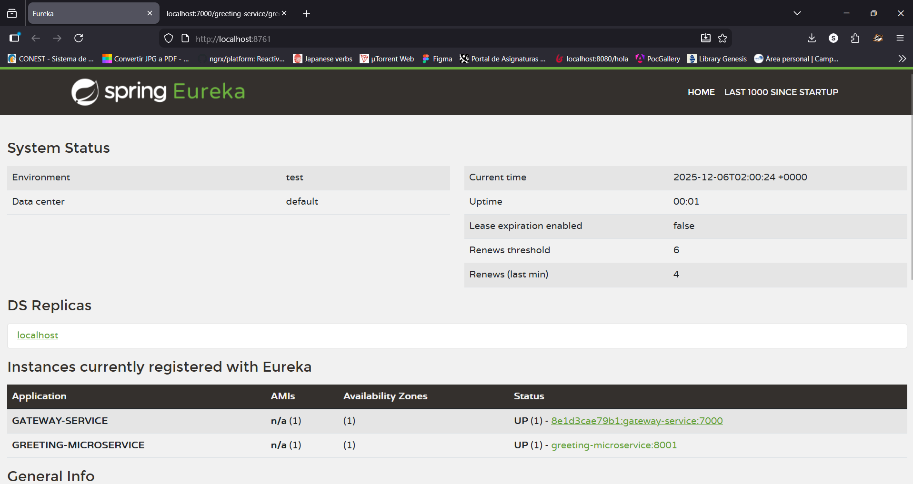
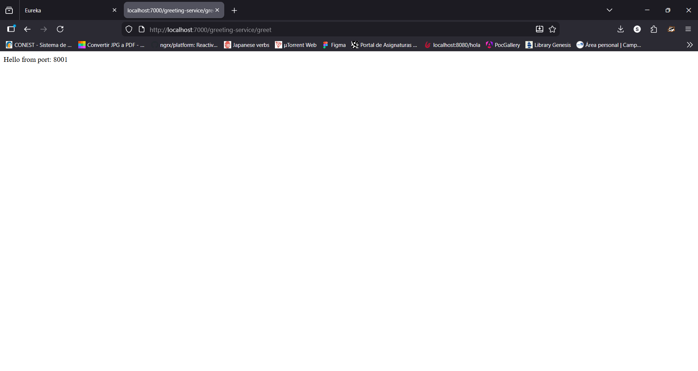

# Reto 9
Practica Laboratorio (4): Mi practica de laboratorio sobre microservicios con SpringBoot

## Mis conclusiones

### ¿Qué diferencia existe entre un proyecto creado con maven y con gradle en su estructura?
La estructura de directorios del proyecto en sí se ve definida es por el framework Springboot, 
siendo la diferencia entre maven y gradle los elementos de control y configuración del proyecto,
 así como el proceso de construcción y empaquetado. \
En ese aspecto la configuración de gradle es más flexible, aunque la cantidad de opciones que
 ofrece también la puede hacer más complicada de aprender.

### ¿Qué caracteriza la definición de dependencias en un pom.xml en contraposición al build.gradle con que estuvimos trabajando hasta el laboratorio anterior?
Al ser un archivo xml, la sintaxis de pom.xml es más estricta, debiendo definir multiples argumentos por 
dependencia y empleando las etiquetas correctas con la jerarquía correcta. Mientras que los bloques del build.gradle
 resultan más flexibles y compactos.

### ¿Cuáles son sus conclusiones?
Con la arquitectura de microservicios controlamos la entrada a nuestra aplicación, filtrando las peticiones y 
enrutando los accesos a los servicios de esta. \
Lo que permite la separación de funcionalidad y responsabilidades a nivel de módulos, y facilita el desarrollo
 continuo en diferentes servicios por equipos de desarrollo grandes.

### ¿Cuál es el poder de la combinación de estas herramientas?
Podemos aprovechar la arquitectura de microservicios para emplear la 
herramienta de gestión que se ajuste mejor a las necesidades de un módulo particular,
así como el framework e incluso lenguaje. \
Todos conectados a traves de un servidor Eureka y redirigiendo las peticiones a cada servicio 
por medio del gateway. \
Mientras que el uso de docker nos permite mantener una ambiente de desarrollo 
consistente para todo el equipo de desarrollo y ajustado a cada componente.

### ¿Qué utilidad le ve en el desarrollo de una aplicación?
Explotamos las ventajas de la modularización, pues cada microservicio es independiente de los demás,
lo que facilita su mantenimiento y escalabilidad. 

### ¿Cómo podríamos aprovechar estos conceptos al desarrollar la aplicación propuesta para el proyecto del semestre?
Cada funcionalidad del proyecto puede separarse en un microservicio independiente, empleando Eureka para contectarlos
y el Gateway para redirigir las peticiones desde una misma entrada en común. 

## TODO
- Actualizar las imágenes empleadas en los dockerfiles. La imagen recomendada en el laboratorio 
se encuentra deprecada, por lo que en su lugar se empleó eclipse-temurin:21-jdk-alpine
- Remover la dependencia spring-cloud-starter-gateway-mvc y remplazarla por spring-cloud-starter-gateway, 
pues esta dió conflictos con la configuración del gateway durante el laboratorio

## Imágenes 
1. Eureka Server

2. Greeting-Microservice

## Mi contacto:
Email: soamaia03@gmail.com